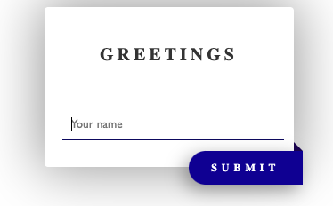

# Demo Rust + WASM



A simple demo about

- calling JS functions from Rust
- calling Rust functions from JS

# Requirements

- NodeJS v18+ https://nodejs.org/en/download
- Rust, https://www.rust-lang.org/tools/install

# Install

- install npm packages
- install wasm-pack, via `cargo install wasm-pack`

# Building

```
$> wasm-pack build --target web
```

# Running

```
$> npx http-server
```

go to http://localhost:8080
